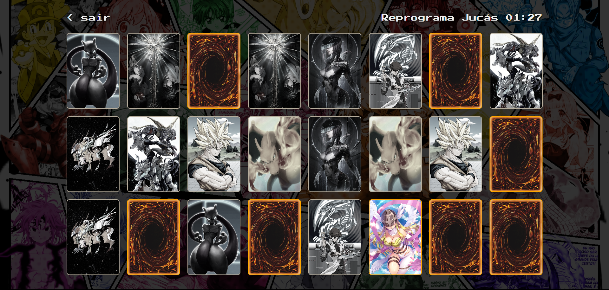

# Memory Game

Este projeto foi desenvolvido na conclusão do módulo de JavaScript do curso de Desenvolvimento Web. O Jogo da Memória é uma aplicação interativa que desafia a encontrar pares de cartas correspondentes e rankear os jogadores pelo melhor tempo.

## Tecnologias Utilizadas

- HTML
- CSS
- JavaScript

## Links

- [Deploy](https://emanuelquintino.github.io/Memory-Game/)
